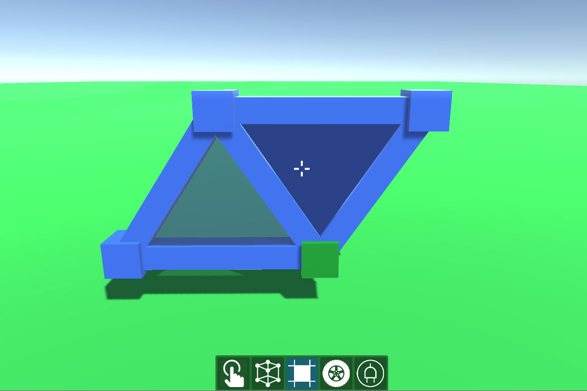
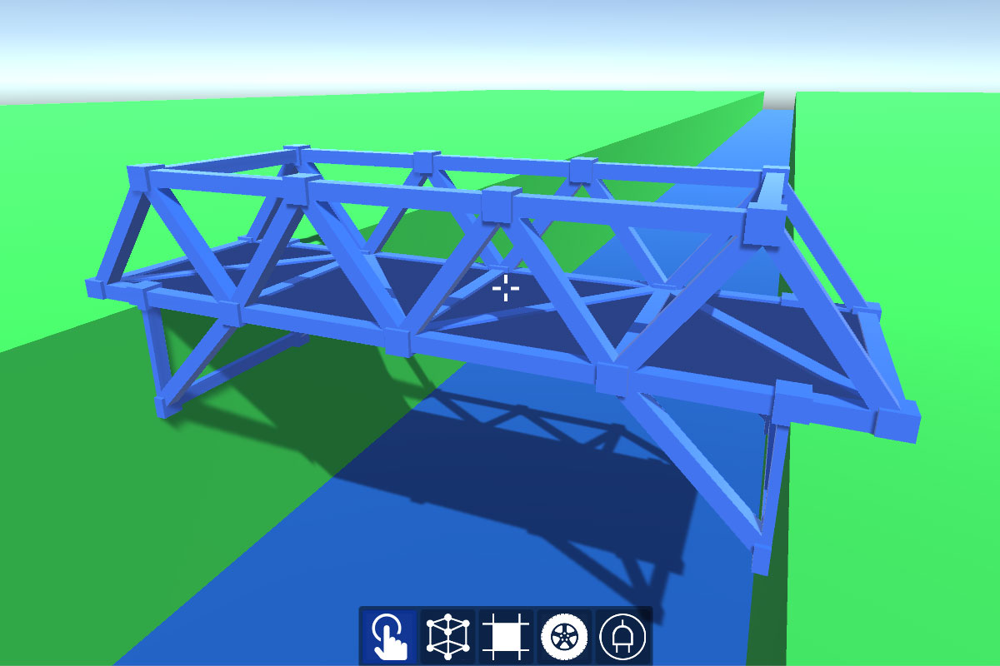

# Colton Wiklund

## World of Warcraft: Reborn
A theoretical version of World of Warcraft based on the original game. Contains updated abilities, talents, equipment, and a new system to promote player discovery.

- [Website](https://www.worldofwarcraftreborn.com)
- [Source](docs/CONTRIBUTING.md)

## Hero Arena
A Dota 2 Custom game written in Lua and published on the steam workshop. Players battle against the other team in a deathmatch arena, best of 5 rounds. Available in 1v1, 2v2, 3v3 gamemodes.

- [Steam Page](https://steamcommunity.com/sharedfiles/filedetails/?id=821151547&searchtext=dota+2+arena+1v1)
- [Source](docs/CONTRIBUTING.md)

## Creator
A Unity project written in C# where the player creates simple structures that interact with the physics engine.

- [Code Example](Creator/Frame/FrameTool.cs.cs)
- [Source](Creator)

#### Overview

> The Frame Tool is used to create a Frame Segment between two points in world space. Frame Segments will automatically connect to any adjacent Frame Segments to create a unified structure.

> The Panel Tool is used to create Panels between Frame Segments. The player selects a vertex and any Panels that can be made will be indicated. Clicking an indicated Panel will build it.

> A basic structure made from the Frame and Panel Tools. The structure has a mass appriopriate for its size and can be interacted with through the physics engine.
